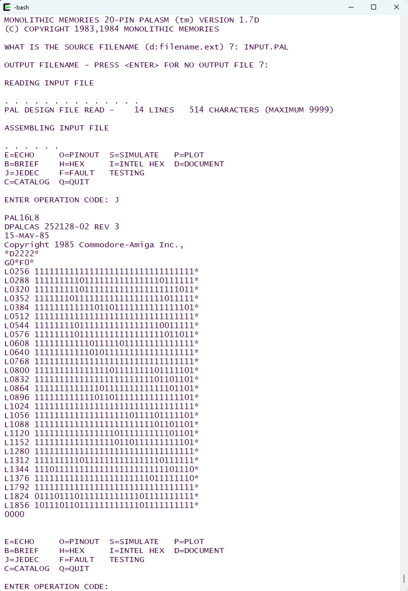

# PALASM 1 Compiler ARCHIVE #

This project provides patches to the PALASM 1 compiler source code to enable it to be built with [GNU Fortran](https://gcc.gnu.org/fortran/).

[PALASM](https://en.wikipedia.org/wiki/PALASM) is a language describing the behavior of programmable array logic ([PAL](https://en.wikipedia.org/wiki/Programmable_Array_Logic)) components into a fuse-map. The fuse-map specifies the low-level configuration of the component, implementing the behaviour defined by the Boolean equations.

PAL components, introduced in the 1980s and 1990s, replaced discrete logic components to reduce PCB size and complexity. These were later replaced by GALs, CPLDs, and FPGAs. Despite this, the PALASM compiler remains useful for understanding and reproducing the logic of retro-computing systems.

The original PALASM 1 compiler was written in FORTRAN IV in the early 1980s and later open-sourced in a book by MMI[^pal2]. Only PALASM 1 source code was published by MMI; PALASM 2 and later versions where made available only in binary form.

Several versions of the source code are available online, though their licensing status remains unclear. Therefore, this repository contains only patches that modify the original source code to make it compilable with GNU Fortran.

## PALASM 1 Versions ##

Various source code versions of PALASM 1 could be found on the internet. The following table summarizes them, ordered by revision date:

|      Origin              | Rev. Date  | Version Number | Variant |   Language    | Target Environment             | Tag/Folder |
| :-----------------:      | :--------: | :------------: | :------ | :-----------: |  :------:                      | :------:   |
| Don Maslin[^mas2]        |  03/04/83  |      1.6A      | 20      | Fortran IV    | VAX/VMS 11/780, IBM SYSTEM/370 | P830304-20 |
| Eric Smith[^es]          |  08/16/83  |      1.6C      | 20      | Fortran IV    | VAX/VMS 11/780, IBM SYSTEM/370 | P830816-20 |
| Eric Smith[^es]          |  08/16/83  |      1.6C      | 24      | Fortran IV    | VAX/VMS 11/780, IBM SYSTEM/370 | P830816-24 |
| Bitsavers[^pd17]         |  06/25/84  |      1.7D      | 20      | Fortran IV    | VAX/VMS 11/780, IBM SYSTEM/370 | P840625-20 |
| Bitsavers[^pd17]         |  06/25/84  |      1.7D      | 24      | Fortran IV    | VAX/VMS 11/780, IBM SYSTEM/370 | P840625-24 |
| Bitsavers[^pd17]         |  07/06/84  |      1.8C      | 40      | Fortran IV,77 | VAX/VMS 11/780, IBM SYSTEM/370 | P840706-40 |
| Bitsavers[^pd17]         |  07/06/84  |      1.8C      | 84      | Fortran IV,77 | VAX/VMS 11/780, IBM SYSTEM/370 | P840706-84 |

The variant refers to the number of pins of the PAL component that the code addresses.

The table is incomplete, but will grow as I make more patches available.

## PALASM 1 Modifications for GFortran Compatibility ##

The original PALASM 1 source code requires modifications to enable compilation with GFortran and execution in a UNIX-like environment. For reference, the guide "Modernizing Old Fortran"[^modfor] provides useful information.

The main changes include:

* data type corrections: the original code does not use the CHARACTER data type, which conflicts with FORMAT specifications. In this patch, INTEGER types have been replaced with CHARACTER where necessary
* pre-connected units: in some versions, the input was originally read from pre-connected unit 1, which would force the input file to be named "fort.1" in a gfortran environment. This has been modified to allow the input file name to be provided as a command-line argument.
* substitution of missing library functions: some functions called from the code are contained in supplemental libraries (e.g. FORLIB), that don't exist in the gfortran environment. Those functions replaced by additional code in separate files.
* file name handling: CP/M versions of PALASM make assumptions on the structure of file names (drive letter + basename + extension). The code was changed to allow for more generic names.

## License ##

All files in this project are provided under the GPL V3 license.

## Build ##

To create a PALASM 1 executable, perform the following steps:

* install the following packages: gfortran, make, diff, patch, wget
* clone the PALASM1-ARCHIVE repository: `git clone https://github.com/aheit/PALASM1-ARCHIVE.git`
* select the variant to be built: `cd PALASM1-ARCHIVE/<variant to be built>`
* download the original source, apply the patch and perform the build: `make`

## Using PALASM 1 ##

The PALASM executable can be launched from the command line without arguments. PALASM then asks for input and output file names, tries to parse input file and shows an interactive menu when done. The menu allows to inspect the result in various forms. The menu is case sensitive and accepts only uppercase letters. JEDEC output is generated by pressing J. When not specifying an output file, the JEDEC file is printed to the console.

[^pal2]: [PAL Programmable Array Logic Handbook 2nd Ed, MMI, 1981](http://bitsavers.informatik.uni-stuttgart.de/components/mmi/_dataBooks/1981_MMI_PAL_Handbook_2ed.pdf)

[^modfor]: [Modernizing Old Fortran](https://fortranwiki.org/fortran/show/Modernizing+Old+Fortran)
[^es]: [MMI PALASM](http://www.brouhaha.com/~eric/retrocomputing/mmi/palasm/) 
[^mas2]: [palasm16.zip](http://www.retroarchive.org/maslin/disks/cpmprog/palasm16.zip)
[^pd17]: [Disk 6/7 of PALASM Distribution](http://www.bitsavers.org/components/mmi/palasm_pleasm/program/palasm_1.7D_1.8/DISK6.ZIP)
